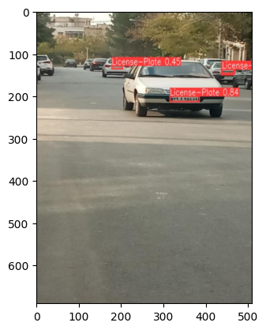

# Persian License Plate Detection

# Description :

using YOLOv8 


# How to install
Run this command to install used libraries : 
```
pip install -r requirements.txt 
```
<br/>
<br/>

# How to run 
you can run `License_Plate_detection.ipynb` file and train model : <br/>


<br/>


# Results : 





### normalized confusion matrix :

<p float="center">
     
</p>
<br />

### F1 curve :
<p float="center">
     
</p>
<br />

### PR curve
<p float="center">
     
</p>
<br />

### labels_correlogram
<p float="center">
     
</p>
<br />
