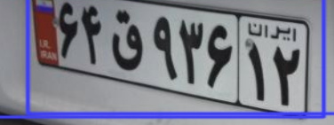

# Persian License Plate Detection - cropped version 

# Description :

using YOLOv8 


# How to install
Run this command to install used libraries : 
```
pip install -r requirements.txt 
```
<br/>
<br/>

# How to run 
you can run `License_Plate_detection_cropped.ipynb` file and train model . <br/>


<br/>


# Cropped plates Results : 




